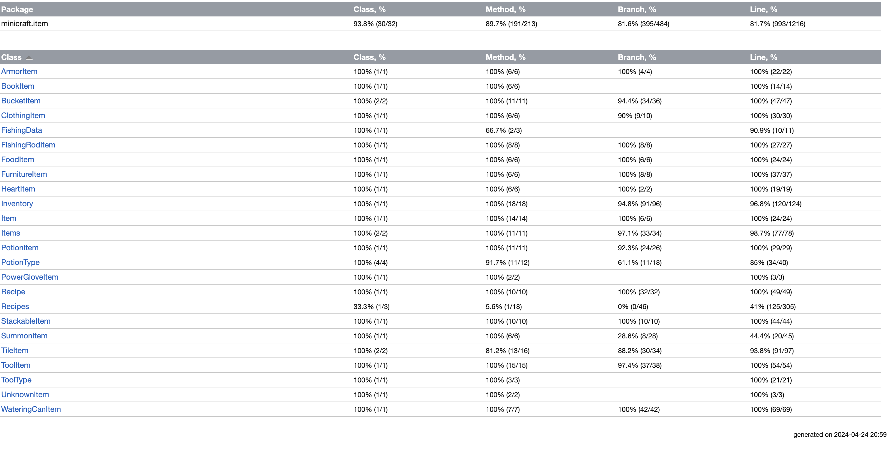

# Testing tools
- White box testing
  - Junit
  - Intellij coverage reportage
- Black box testing
  - Junit
- Mock testing
  - mockito inline library
- Integration testing
  - Junit

**Note:** All tests can be found in the `src/test/java` folder. White box and mock tests are in the format `*Test` whilst black box are in the form `*BlackBoxTest`

# SUT
The files tested can all be found in the `src/client/item` folder

# White box and mock tests

## Reproducing coverage results
**Note:** You will need to run the tests twice, unless tests that should pass will fail, I believe this may be related to using an unstable version of mockito, I talked to the professor about this problem but we couldn't find a solution
[coverage_generation.mov](coverage_generation.mov)

## White box Coverage

## Limitations to White box testing

**Unfortunately we could not reach 100% code coverage for white box testing due to limitations we were unaware of at the time of project proposal, limitations we highlight below**

### BucketItem
- Equals method
  - name and filling are private variables and we can't change these variables to increase branch coverage
- interactOn method
  - Similarly filling is a private variable and can't control filling for different fills

### ClothingItem
- interactOn method
  - getAllInstances method always returns instances of clothingItems, so we cannot test a case where this is false

### Inventory
- add method
  - unlimited is a protected variable, there is no where in the class where unlimited is changed to true, so there's no way to test cases where unlimited is true
- removeFromStack method
  - removed at max can only be equals to amountRemaining due to operations in function, hence the condition removed > count will never be reached
- removeItems method
  - count > 0 relies on removeFromStack having removed > count, since this is never possible this condition can never be true

### PotionItem
- apply position method
  - Due to the logic of the overloaded apply position helper method, it's not possible for result to be true and time to be <= 0
- Equals method
  - Since we don't have access to the name field, we have to work with the instances of potionItems available to us, however there is no case where the names are different but the types are the same or vice versa

### PotionType
- toggle effect method for escape
  - Depth is a final variable for level class. Since level doesn't have a public method and there's no way to mock a different final variable, we couldn't test the states of playerdepth != 0

### Recipes
- main function
  - The logic in main is used for GUI testing, since there's no output to test or input to manipulate and we are not testing GUI we were unable to test the main method
  - **Note:** even without explicitly testing the main function, we still test over 2000 loc

### SummonItem
- interact on method
  - Depth is a final variable for level class. Since level doesn't have a public method and there's no way to mock a different final variable, we couldn't test the states of playerdepth != 0

### TileItem
- get all instances method
  - The logic to mock the conditions that will allow for full branch coverage of this function are well outside the items method.
- TileItem constructor
  - There is no way to call this method as it's protected
- interact on method, equals method and hashCode method
  - TileItem has a protected constructor, there is no way to test the case in which the model is null

### ToolItem
- isDepleted method
  - type.durability is final and always greater than 0

**Note**: We used extensive mock testing and mocking in our white box testing, that is we used mock testing hand in hand in our white box tests.

## Discovered faults (Whitebox)
1. **testRemoveItemNoneStackingItemManyRemove** reveals a fault in the **inventor** class, inventory loops until i == size of the list of items being stored, however if you remove an item you change the size of the list, so let's say the inventory has two items and you remove the first item, the loop will terminate before checking whether to remove the second item. A fix would be to store before hand the initial size of the list and use this size for loop termination.
2. **testConstructInvalidReqItems** and **testConstructorInvalidCreatedItems** reveals a fault in the constructor of the **Recipe** class, namely there is no error checking of the input for the constructor and no throws annotations are written on the class, although it you pass in a poorly formatted string, an error will occur
3. **testGetAttackDamageBonusDurMobPickaxe** reveals a fault in the getAttackDamageBonus method of the **ToolItem** class, the attack damage bonus is stated to always be between 3 and 6 for wooden pickaxes, however this is not the case, the likely fault is that there is a math error in the calculation of a random bonus damage between these values

# BlackBox
## coverage
We aimed for achieving each choice coverage of input partitioning. In situations where input partitioning was not possible, we attempted to use output partitioning, using the same coverage criterion. Some methods could not achieve ECC for reasons that have to do with the implementation of the functions. For instance, some functions could only return False.

## Blackbox limitations
### Specifications
It was challenging to do blackbox testing on module we focused on, since the whole code base has little to no specifications. We did our best to imagine what the specifications for each method would look like (or looked for external resources like Minicraft Wiki for guidance), and we wrote tests according to those specifications.

In addition, testing most of the classes needed the use of classes that are outside the scope of our target (for instance, many object classes required a Game, Player, and Level class to successfully run all of their functions, and these listed classes are not in the Items folder that we dedicated our project to), and we either had to mock the functions or dive deep in understanding of how other classes work as well. We tried to learn and use those classes to the best of our ability, but we cannot be sure that we used all variations of the classes in achieving all choice coverage because we could not find all possible use cases.

### Methods definitions
Most methods were defined as private or protected, and this limited the number of functions we could test as blackbox.

## Discovered faults (Blackbox)
1. **testBucketSuccessfullyFilled/testBucketCannotBeFilled** reveals a fault in the **Bucket** class, where the Buckets received by the getAll() method do not have their Fill.contained field set. Therefore, when trying to use those generated buckets in the game, a NullPointerException is returned.
2. **testNewFurnitureWithNullConstructor** reveals a fault in **FurnitureItem** - this time, in one of the rare cases where a constructor is publicly accessible, the user is able to create a null object (note that this includes the sprite rendered on the screen) and the interactOn() method returns true nonetheless. Having a null furniture object in the game could have undefined behavior, so a check for null elements within the method would be recommended.
3. The various **testRemoveItem** test cases in **Inventory** reveal a fault within the logic of the removal. When prompted for a count, users can put in invalid counts for the number of items to remove (negative, zero, a number that exceeds the quantity in inventory, items not in inventory, etc.), and the function will still operate as if a positive integer was entered, affecting the inventory contents in unpredictable ways. The method ought to return whenever it is given an invalid count.
# Integration testing
It was difficult to find integration points for the classes we tested since most of them integrate in classes that are outside the scope of our target. Logically, this make sense as well since most Items would not interact with each other in their definitions. We managed to find integrations in Inventory class and we created an integration test for Inventory class interacting with other classes.

# Presentation slides
https://docs.google.com/presentation/d/1E694S9wW8zk4PG-As2q7P9memtDqbMaC/edit#slide=id.p4
